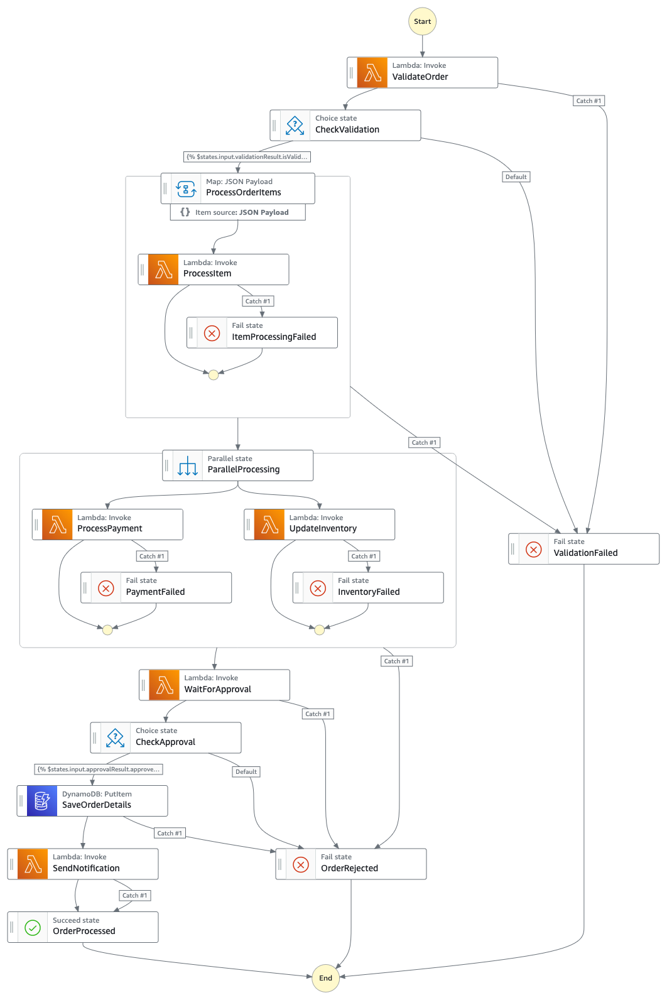

# Step Functions Testing with TestState API

This sample demonstrates comprehensive testing of AWS Step Functions using the **TestState API** with a fluent testing framework. It showcases advanced testing patterns for complex Step Functions workflows including Map states, Parallel states, Choice states, integration patterns such as .waitForTaskToken, retry mechanisms, and error handling.

## 🏗️ Overview

This sample provides a complete example of:
- **AWS Step Functions TestState API** usage for unit testing state machines
- **Fluent API testing patterns** with method chaining
- **Comprehensive test coverage** for all Step Functions state types
- **CI/CD pipeline** with GitHub Actions
- **SAM deployment** for serverless applications

## 🔄 Step Functions Workflow

The sample demonstrates testing of a complete order processing workflow:



This workflow includes:
- **Order Validation**: Validates incoming order data
- **Choice Logic**: Routes based on validation results
- **Map State**: Processes multiple items with error tolerance
- **Parallel Processing**: Handles payment and inventory concurrently
- **Error Handling**: Comprehensive retry and catch mechanisms
- **Notifications**: Success and failure notification paths

## 📁 Sample Structure

```
sample-stepfunctions-testing-with-testStateAPI/
├── README.md                           # This file
├── requirements.txt                    # Python dependencies
├── template.yaml                       # SAM template for deployment
├── .github/
│   └── workflows/
│       └── test-and-deploy.yml        # CI/CD pipeline
├── src/                               # Lambda function source code
│   ├── validate_order/
│   │   └── app.py                     # Order validation Lambda
│   ├── process_payment/
│   │   └── app.py                     # Payment processing Lambda
│   └── send_notification/
│       └── app.py                     # Notification Lambda
├── statemachine/
│   └── order_processing.asl.json     # Step Functions state machine definition
└── tests/
    ├── conftest.py                    # Test fixtures and fluent API framework
    └── unit_test.py                   # Comprehensive test suite
```

## 🚀 Quick Start

### Prerequisites

- **Python 3.9+**
- **AWS CLI** configured with appropriate credentials
- **SAM CLI** for local development and deployment
- **pytest** for running tests

### 1. Environment Setup

```bash
# Clone or navigate to the sample directory
cd sample-stepfunctions-testing-with-testStateAPI

# Create and activate virtual environment
python3 -m venv venv
source venv/bin/activate  # On Windows: venv\Scripts\activate

# Install dependencies
pip install -r requirements.txt
```

### 2. AWS Configuration

Ensure your AWS credentials are configured:

```bash
# Configure AWS CLI (if not already done)
aws configure

# Verify access to Step Functions
aws stepfunctions list-state-machines --region us-east-1
```

### 3. Running Tests

#### Run All Tests
```bash
# Run the complete test suite
pytest tests/unit_test.py -v
```

#### Run Specific Test Categories
```bash
# Run only happy path tests
pytest tests/unit_test.py::TestOrderProcessingStateMachine::test_complete_order_processing_workflow -v

# Run only error handling tests
pytest tests/unit_test.py -k "error" -v

# Run only retry mechanism tests
pytest tests/unit_test.py -k "retry" -v

# Run JSONata transformation tests
pytest tests/unit_test.py -k "jsonata" -v
```

## 🧪 Testing Framework

### Fluent API Testing Pattern

This sample uses a **fluent API pattern** for building and executing Step Functions tests:

```python
def test_example(runner):
    """Example of fluent API testing pattern"""
    test_input = {"orderId": "order-123", "amount": 100.0}
    mock_result = {"isValid": True, "orderId": "order-123"}
    
    # Method chaining for readable test construction
    (runner
     .with_input(test_input)
     .with_mock_result(mock_result)
     .execute("ValidateOrder")
     .assert_succeeded()
     .assert_next_state("CheckValidation"))
```

### Key Testing Features

#### 1. **State Type Coverage**
- ✅ **Task States** (Lambda, DynamoDB, SNS)
- ✅ **Choice States** (conditional branching)
- ✅ **Map States** (Distributed Map with ToleradtedFailureThreshold)
- ✅ **Parallel States** (concurrent execution)
- ✅ **Wait States** (including waitForTaskToken)
- ✅ **Pass/Succeed/Fail States**

#### 2. **Error Handling & Retry Testing**
- ✅ **Retry mechanisms** with exponential backoff
- ✅ **Catch blocks** and error routing
- ✅ **Tolerance thresholds** in Map states
- ✅ **Branch failures** in Parallel states

#### 3. **Advanced Features**
- ✅ **JSONata transformations**
- ✅ **Context object usage**
- ✅ **State configuration** (retry counts, error sources)
- ✅ **Inspection data** validation

## 📋 Test Categories

### 1. Happy Path Tests
Tests the complete workflow execution with successful outcomes:

```bash
pytest tests/unit_test.py::TestOrderProcessingStateMachine::test_complete_order_processing_workflow -v
```

**Covers:**
- Complete order processing workflow
- State transitions and data flow
- JSONata transformations
- Context object usage

### 2. Error Handling Tests
Tests retry mechanisms and error scenarios:

```bash
pytest tests/unit_test.py -k "retry" -v
```

**Covers:**
- Lambda throttling retry mechanisms
- Map state tolerance thresholds
- Parallel state branch failures
- Exponential backoff validation

### 3. Negative Scenario Tests
Tests validation failures and rejection paths:

```bash
pytest tests/unit_test.py -k "failure" -v
```

**Covers:**
- Order validation failures
- Approval rejection workflows
- Terminal failure states

### 4. JSONata Transformation Tests
Tests data transformation and context usage:

```bash
pytest tests/unit_test.py -k "jsonata" -v
```

**Covers:**
- Data merging and transformation
- Context object integration
- Complex JSONata expressions

## 🔧 Development Workflow

### Local Testing
```bash
# Run tests in watch mode during development
pytest tests/unit_test.py -v --tb=short -x

# Run specific test with detailed output
pytest tests/unit_test.py::TestOrderProcessingStateMachine::test_lambda_throttling_retry_mechanism -v -s
```

#### Network Isolated Testing with LocalStack
For completely local testing without requiring AWS connectivity, you can use [LocalStack](https://docs.localstack.cloud/aws/services/stepfunctions/) to emulate AWS services locally. This enables testing in network-isolated environments and can speed up development cycles.

To use LocalStack for Step Functions testing:
1. Configure LocalStack in your machine and [start LocalStack](https://docs.localstack.cloud/aws/getting-started/installation/) and ensure that localstack is running
2. Modify the `conftest.py` to point to LocalStack endpoint as below:
```
def sfn_client():
    """Step Functions client for TestState API calls"""
    return boto3.client('stepfunctions', region_name='us-east-1',endpoint_url='http://localhost.localstack.cloud:4566')
```
3. Run tests against the local Step Functions emulation

For more information on enhancing local testing with LocalStack, see the AWS blog post: [Enhance the Local Testing Experience for Serverless Applications with LocalStack](https://aws.amazon.com/blogs/compute/enhance-the-local-testing-experience-for-serverless-applications-with-localstack/).
Note:- Please note that at the time of publishing this sample, LocalStack may not yet have support for specific features with enahnced TestState API.

### SAM Local Development
```bash
# Build the SAM application
sam build

# Deploy to AWS (development)
sam deploy --guided

# Clean up resources
sam delete
```

## 🚀 CI/CD Pipeline

The sample includes a simple GitHub Actions workflow (`.github/workflows/test-and-deploy.yml`) that demonstrates basic CI/CD:

1. **Unit Tests**: Runs the test suite locally using `pytest tests/unit_test.py`
2. **SAM Deploy**: Deploys resources to AWS using `sam build` and `sam deploy`

**Note**: In a production scenario, you would typically extend this pipeline to include additional stages such as deploying to a development account first, performing integration testing against deployed resources, and then promoting to a production account with proper approval gates.

### Pipeline Triggers
- **Push** to `main` or `develop` branches
- **Pull Requests** to `main` branch

### Required Secrets
Configure these AWS credentials in your GitHub repository settings to enable the GitHub Actions workflow to deploy resources to your AWS account. For detailed setup instructions, see the AWS blog post: [Using GitHub Actions to Deploy Serverless Applications](https://aws.amazon.com/blogs/compute/using-github-actions-to-deploy-serverless-applications/).

Required secrets:
- `AWS_ACCESS_KEY_ID`
- `AWS_SECRET_ACCESS_KEY`
- `AWS_REGION`

## 📊 Test Coverage

The test suite provides comprehensive coverage:

| Component | Coverage |
|-----------|----------|
| **State Types** | All 7 Step Functions state types |
| **Error Scenarios** | Retry, catch, tolerance mechanisms |
| **Data Flow** | Input/output transformations |
| **Context Usage** | Task tokens, execution metadata |
| **Advanced Features** | JSONata, distributed Map states |

## 📚 Additional Resources

- [AWS Step Functions TestState API Documentation](https://docs.aws.amazon.com/step-functions/latest/dg/test-state-isolation.html)
- [Step Functions Developer Guide](https://docs.aws.amazon.com/step-functions/latest/dg/)
- [SAM Developer Guide](https://docs.aws.amazon.com/serverless-application-model/latest/developerguide/)
- [JSONata Documentation](https://jsonata.org/)
